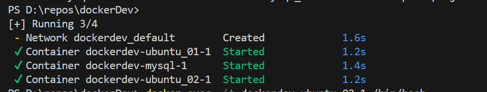
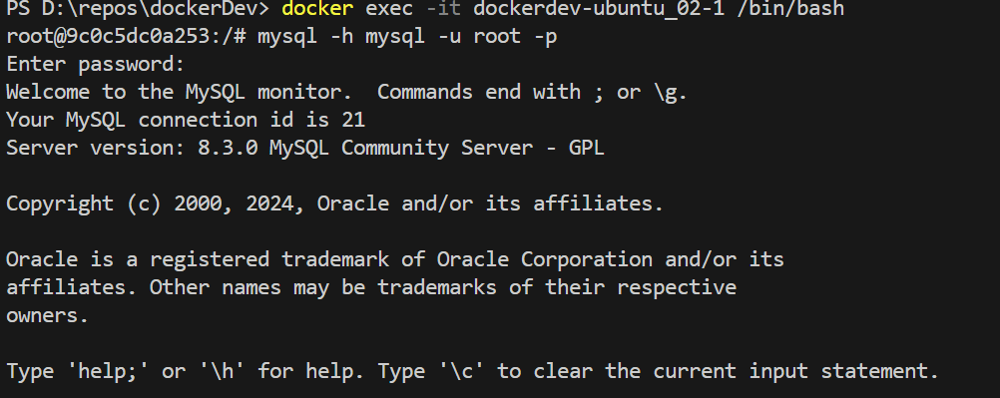

# 使用Docker-compose创建集群

使用的docker compose配置文件
```docker-compose
version: '3.8'

services:
  ubuntu_01:
    image: my_ubuntu1
    command: /bin/bash -c "tail -f /dev/null"
    restart: always

  ubuntu_02:
    image: my_ubuntu1
    command: /bin/bash -c "tail -f /dev/null"
    restart: always

  mysql:
    image: mysql
    environment:
      MYSQL_ROOT_PASSWORD: zrzr1234
      MYSQL_DATABASE: databaseofzr
    ports:
      - "3306:3306"
    restart: always


```

创建效果



从集群中的其他linux访问mysql数据库：

