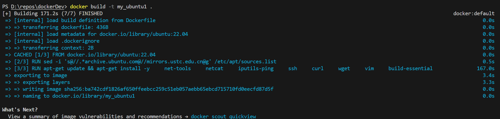
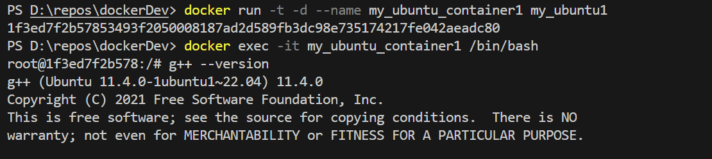

# Docker构建自己的镜像

这里使用的Dockerfile是
```dockerfile
FROM ubuntu:22.04

# Install Dependencies
ENV DEBIAN_FRONTEND=noninteractive

# Update software sources to Tsinghua mirror
RUN sed -i 's@//.*archive.ubuntu.com@//mirrors.ustc.edu.cn@g' /etc/apt/sources.list

# Install utilities
RUN apt-get update && apt-get install -y \
    net-tools \
    netcat \
    iputils-ping \
    ssh \
    curl \
    wget \
    vim \
    build-essential
```
因为原软件源速度过慢，这里使用sed统一更换了软件源地址

build截图如下  



使用镜像启动容器:


